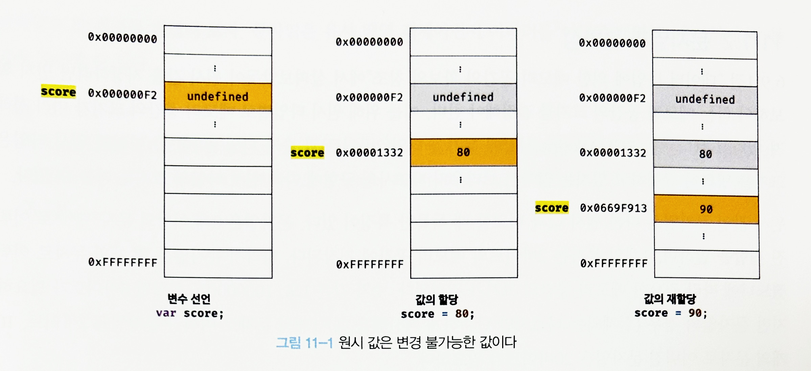
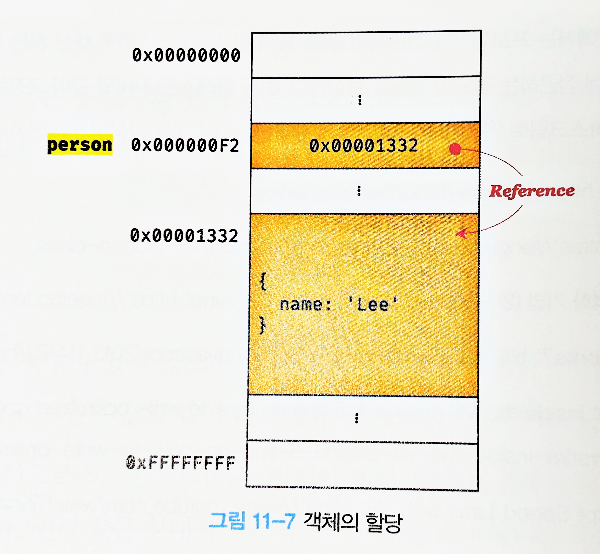

# 11-원시 값과 객체의 비교

- 원시 타입
  - 원시 값은 변경 불가능한 값이다.
  - 원시 값을 변수에 할당하면 변수에는 실제 값이 저장된다.
  - 원시 값을 다른 변수에 할당하면 원시 값이 복사되어 저장된다.
    - '값에 의한 전달'
- 객체 타입
  - 객체는 변경 가능한 값이다.
  - 객체를 변수에 할당하면 변수에는 참조 값이 저장된다.
  - 객체를 가리키는 변수를 다른 변수에 할당하면 참조 값이 복사되어 전달된다.
    - '참조에 의한 전달'

## 💕 원시 값




- 변수에 새로운 원시 값을 재할당했을 때 원시 값을 변경하는 것이 아니라 변수는 새롭게 할당된 메모리의 원시 값을 가리킨다.
- 불변성을 갖는 원시 값을 할당한 변수는 재할당 이외에 변수 값을 변경할 수 있는 방법이 없다.

### 🤍 값에 의한 전달

```js
var score = 80
var copy = score;

console.log(score); // 80
console.log(copy); // 80

score = 100;

console.log(score); // 80
console.log(copy); // ?
```

- `copy` 에는 `score` 의 원시 값(80)이 복사되어 전달된다.
- 이처럼 변수에 원시 값을 갖는 변수를 할당하면 할당받는 변수(`copy`)에는 할당되는 변수(`score`)의 원시 값이 복사되어 전달된다.
- `var copy = score;` 를 한 시점 이후부터는 `copy` 랑 `score` 는 서로 독립적인 변수이다.
- **결국은 두 변수의 원시 값은 서로 다른 메모리 공간에 저장된 별개의 값이 되어 어느 한쪽에서 재할당을 통해 값을 변경하더라도 서로 간섭할 수 없다.**

## 💕 객체
- 객체는 프로퍼티의 개수가 정해져 있지 않으며, 동적으로 추가하고 삭제할 수 있다.

### 🤍 변경 가능한 값
- 객체 타입의 값, 즉 객체는 변경 가능한 값이다.

```js
var person = {
    name: 'Lee'
}
```

- 객체를 할당한 변수가 기억하는 메모리 주소를통해 메모리 공간에 접근하면 **참조 값**에 접근할 수 있다.
  - 참조 값은 객체가 저장된 메모리 공간의 주소 그 자체다.



- 원시 값을 할당한 변수를 참조하면 메모리에 저장되어 있는 원시 값에 접근한다.
- 하지만 객체를 할당한 변수를 참조하면 메모리에 저장되어 있는 참조 값을 통해 실제 객체에 접근한다.

```js
// 할당이 이루어지는 시점에 객체 리터럴이 해석되고, 그 결과 객체가 생성된다.
var person = {
    name: 'Lee'
};

// person 변수에 저장되어 있는 참조 값으로 실제 객체에 접근한다.
console.log(person); // {name: "Lee"}
```

- **객체를 할당한 변수는 재할당 없이 객체를 직접 변경할 수 있다.**
- **즉, 재할당 없이 프로퍼티를 동적으로 추가할 수도 있고 프로퍼티 값을 갱신할 수도 있으며 프로퍼티 자체를 삭제할 수도 있다.**
- 객체는 이러한 구조적 단점에 따른 부작용이 있는데, 여러 개의 식별자가 하나의 객체를 공유할 수 있다는 점이다.

### 🤍 참조에 의한 전달

```js
var person = {
    name: 'Lee'
};

// 참조 값을 복사(얕은 복사)
var copy = person;
```

- `person` 을 `copy` 에 할당하면 원본의 참조 값이 복사되어 전달된다.
  - **이를 참조에 의한 전달** 이라 한다.
- `person` 과 `copy` 가 모두 동일한 객체를 가리킨다.
  - 이것은 **두 개의 식별자가 하나의 객체를 공유**한다는 것을 의미한다.

```js
var person = {
  name: 'Lee'
};

// 참조값을 복사(얕은 복사). copy와 person은 동일한 참조값을 갖는다.
var copy = person;

// copy와 person은 동일한 객체를 참조한다.
console.log(copy === person); // true

// copy를 통해 객체를 변경한다.
copy.name = 'Kim';

// person을 통해 객체를 변경한다.
person.address = 'Seoul';

// copy와 person은 동일한 객체를 가리킨다.
// 따라서 어느 한쪽에서 객체를 변경하면 서로 영향을 주고 받는다.
console.log(person); // {name: "Kim", address: "Seoul"}
console.log(copy);   // {name: "Kim", address: "Seoul"}
```

- "값에 의한 전달" 과 "참조에 의한 전달" 은 식별자가 기억하는 메모리 공간에 저장되어 있는 값을 복사해서 잔달한다는 면에서 동일하다.
- 다만 변수에 저장되어 있는 값이 원시 값인지 참조 값인지의 차이만 있다.

```js
var person1 = {
  name: 'Lee'
};

var person2 = {
  name: 'Lee'
};

console.log(person1 === person2); // ①
console.log(person1.name === person2.name); // ②
```
- 1번은 false, 2번은 true
- 객체의 내용은 값지만 다른 메모리에 저장되어있기 때문이다.