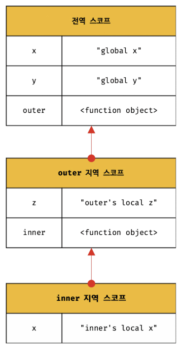

# 13-스코프

## 💕 스코프란?
- 스코프(유효범위)는 모든 프로그래밍 언어의 기본적이며 중요한 개념이다.

```js
function add(x, y) {
  // 매개변수는 함수 몸체 내부에서만 참조할 수 있다.
  // 즉, 매개변수의 스코프(유효범위)는 함수 몸체 내부다.
  console.log(x, y); // 2 5
  return x + y;
}

add(2, 5);

// 매개변수는 함수 몸체 내부에서만 참조할 수 있다.
console.log(x, y); // ReferenceError: x is not defined
```

- 변수는 코드 블록이나 함수 몸체 내에서도 선언할 수 있다.

```js
var var1 = 1; // 코드의 가장 바깥 영역에서 선언한 변수

if (true) {
  var var2 = 2; // 코드 블록 내에서 선언한 변수
  if (true) {
    var var3 = 3; // 중첩된 코드 블록 내에서 선언한 변수
  }
}

function foo() {
  var var4 = 4; // 함수 내에서 선언한 변수

  function bar() {
    var var5 = 5; // 중첩된 함수 내에서 선언한 변수
  }
}

console.log(var1); // 1
console.log(var2); // 2
console.log(var3); // 3
console.log(var4); // ReferenceError: var4 is not defined
console.log(var5); // ReferenceError: var5 is not defined
```

- 모든 식별자는 자신이 선언된 위치에 의해 다른 코드가 식별자 자신을 참조할 수 있는 유효 범위가 결정된다.
  - 이를 스코프라 한다.
  - 즉, 스코프는 식별자가 유효한 범위를 말한다.

```js
var x = 'global';

function foo() {
  var x = 'local';
  console.log(x); // ①
}

foo();

console.log(x); // ②
```

- 코드의 가장 바깥 영역과 `foo` 함수 내부에 같은 이름을 갖는 `x` 변수를 선언했고 ①과 ②에서 `x` 변수를 참조한다.
- 이때 자바스크립트 엔진은 이름이 같은 두 개의 변수 중에서 어떤 변수를 참조해야 할 것인지를 결정해야 한다.
  - 이를 **식별자 결정**이라 한다.
  - 스코프란 자바스크립트 엔진이 **식별자를 검색할 때 사용하는 규칙**이라고도 할 수 있다.
- 위 예제에서 `x = global` 은 전역 스코프고 `x = local` 은 `foo` 함수 스코프이다.
  - 두 개의 변수는 식별자 이름이 동일하지만 스코프가 다른 별개의 변수다.

## 💕 스코프의 종류

- 코드는 전역과 지역으로 구분할 수 있다.

| 구분 | 설명 | 스코프 | 변수 |
| --- | --- | --- | ---
| 전역 | 코드의 가장 바깥 영역 | 전역 스코프 | 전역 변수 |
| 지역 | 함수 몸체 내부 | 지역 스코프 | 지역 변수 |

- 변수는 자신이 선언된 위치에 따라 스코프가 결졍된다.

### 🤍 전역과 전역 스코프

- 전역이란 코드의 가장 바깥 영역을 말한다.
- 전역 변수는 어디서든지 참조할 수 있다.

### 🤍 지역과 지역 스코프

- 지역이란 **함수 몸체 내부**를 말한다.
- 지역 변수는 자신의 지역 스코프와 하위 지역 스코프에서 유효하다.

## 💕 스코프 체인

- 함수는 전역에서 정의할 수도 있고 함수 몸체 내부에서 정의할 수도 있다.
  - 함수 몸체 내부에서 함수가 정의된 것을 **함수의 중첩** 이라 한다.
  - 함수 몸체 내부에서 정의한 함수를 **중첩 함수** 라 한다.
    - 중첩 함수를 포함하는 함수를 **외부 함수** 라 한다.
- 함수는 중첩될 수 있으므로 함수의 지역 스코프도 중첩될 수 있다.
  - 이는 **스코프가 함수의 중첩에 의해 계층적 구조를 갖는다** 는 것을 의미한다.



- 이처럼 모든 스코프는 하나의 계층적 구조로 연결되며, 모든 지역 스코프의 최상위 스코프는 전역 스코프다.
  - 이렇게 스코프가 계층적으로 연결된 것을 **스코프 체인**이라 한다.
- 변수를 참조할 때 자바스크립트 엔진은 스코프 체인을 통해 변수를 참조하는 코드의 스코프부터 시작하여 상위 스코프 방향으로 이동하며 선언된 변수를 검색한다.
- 상위 스코프에서 유효한 변수는 하위 스코프에서 자유롭게 참조할 수 있지만 하위 스코프에서 유효한 변수를 상위 스코프에서 참조할 수 없다.

## 💕 함수 레벨 스코프

- 코드 블록이 아닌 함수에 의해서만 지역 스코프가 생성된다.
- `var` 키워드로 선언된 변수는 오로지 함수의 코드 블록만을 지역 스코프로 인정한다.
  - 이러한 특성을 **함수 레벨 스코프**라 한다.

```js
var x = 1;

if (true) {
  // var 키워드로 선언된 변수는 함수의 코드 블록(함수 몸체)만을 지역 스코프로 인정한다.
  // 함수 밖에서 var 키워드로 선언된 변수는 코드 블록 내에서 선언되었다 할지라도 모두 전역 변수다.
  // 따라서 x는 전역 변수다. 이미 선언된 전역 변수 x가 있으므로 x 변수는 중복 선언된다.
  // 이는 의도치 않게 변수 값이 변경되는 부작용을 발생시킨다.
  var x = 10;
}

console.log(x); // 10
```

- `var` 키워드로 선언된 변수는 오로지 함수의 코드 블록만을 지역 스코프로 인정하지만, `ES6` 에서 도입된 `let`, `const` 는 블록 레벨 스코프를 지원한다.

## 💕 렉시컬 스코프

```js
var x = 1;

function foo() {
  var x = 10;
  bar();
}

function bar() {
  console.log(x);
}

foo(); // 1
bar(); // 1
```

- 함수를 어디서 호출했는지에 따라 함수의 상위 스코프를 결정한다.
  - 이를 동적 스코프라 한다.
- 함수를 어디서 정의했는지에 따라 함수의 상위 스코프를 결정한다.
  - 이를 랙시컬 스코프라 한다.
- 자바스크립트는 랙시컬 스코프를 따른다.
  - 즉, 함수의 상위 스코프는 언제나 자신이 정의된 스코프다.
- 위 예제의 `bar` 함수는 전역에서 정의된 함수다.
  - 생성된 `bar` 함수는 전역 스코프를 기억한다.
  - 그리고 `bar` 함수가 호출되면 호출된 곳이 어디인지 관계없이 언제나 자신이 기억하고 있는 전역 스코프를 상위 스코프로 사용한다.

```js
```

```js
```

```js
```

```js
```

```js
```

```js
```

```js
```

```js
```

```js
```

```js
```

```js
```

```js
```

```js
```

```js
```
