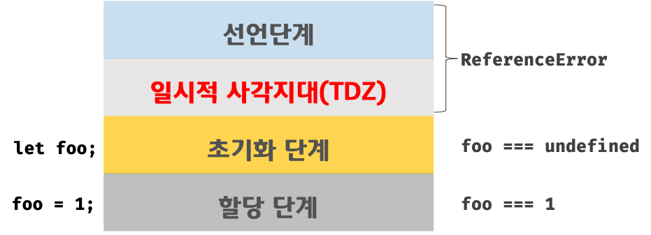

# 15-let, const 키워드와 블록 레벨 스코프

## 💕 var 키워드로 선언한 변수의 문제점

- `var` 키워드로 선언한 변수는 중복 허용이 가능하다.
- `var` 키워드로 선언한 변수는 오로지 함수의 코드 블록만을 지역 스코프로 인정한다.
- `var` 키워드로 선언한 변수는 변수 호이스팅이 발생한다.

## 💕 let 키워드

- `var` 키워드의 단점을 보완하기 위해 `ES6` 에서 `let` 와 `const` 를 도입했다.

### 🤍 변수 중복 선언 금지

```js
var foo = 123;
// var 키워드로 선언된 변수는 같은 스코프 내에서 중복 선언을 허용한다.
// 아래 변수 선언문은 자바스크립트 엔진에 의해 var 키워드가 없는 것처럼 동작한다.
var foo = 456;

let bar = 123;
// let이나 const 키워드로 선언된 변수는 같은 스코프 내에서 중복 선언을 허용하지 않는다.
let bar = 456; // SyntaxError: Identifier 'bar' has already been declared
```

### 🤍 블록 레벨 스코프

- `let` 키워드로 선언한 변수는 모든 코드 블록을 지역 스코프로 인정하는 블록 레벨 스코프를 따른다.

```js
let foo = 1; // 전역 변수

{
  let foo = 2; // 지역 변수
  let bar = 3; // 지역 변수
}

console.log(foo); // 1
console.log(bar); // ReferenceError: bar is not defined
```

### 🤍 변수 호이스팅

- `let` 키워드로 선언한 변수는 변수 호이스팅이 발생하지 않는 것처럼 동작한다.

```js
// 런타임 이전에 선언 단계가 실행된다. 아직 변수가 초기화되지 않았다.
// 초기화 이전의 일시적 사각 지대에서는 변수를 참조할 수 없다.
console.log(foo); // ReferenceError: foo is not defined

let foo; // 변수 선언문에서 초기화 단계가 실행된다.
console.log(foo); // undefined

foo = 1; // 할당문에서 할당 단계가 실행된다.
console.log(foo); // 1
```

- `let` 키워드로 선언한 변수는 변수 선언문 이전에 변수를 참조할 수 없다.
  - 런타임 이전에 선언 단계가 실행되긴 한다.
  - 이를 **일시적 사각지대**라고 부른다.
  


### 🤍 전역 객체와 let

- `let` 변수로 선언한 전역 변수는 전역 객체의 프로퍼티가 아니다.
- `let` 전역 변수는 보이지 않는 개념적인 블록 내에 존재하게 된다.

```js
// 이 예제는 브라우저 환경에서 실행해야 한다.
let x = 1;

// let, const 키워드로 선언한 전역 변수는 전역 객체 window의 프로퍼티가 아니다.
console.log(window.x); // undefined
console.log(x); // 1
```

## 💕 const 키워드

- `const` 키워드는 상수를 선언하기 위해 사용한다.
- `const` 키워드의 특징은 `let` 키워드와 대부분 동일한다.

### 🤍 선언과 초기화

- `const` 키워드로 선언한 변수는 반드시 선언과 동시에 초기화해야 한다.
 
```js
const foo1 = 1;
const foo2; // SyntaxError: Missing initializer in const declaration
```

### 🤍 재할당 금지

- `const` 키워드로 선언한 변수에 원시 값을 할당한 경우 원시 값을 변경할 수 없다.
- 이러한 특징을 이용해 `const` 키워드를 상수로 표현하는 데 사용하기도 한다.
  - 상수는 재할당이 금지된 변수를 말한다
- 일반적으로 상수의 이름은 대문자와 스네이크 케이스로 표현한다.

```js
// 세율을 의미하는 0.1은 변경할 수 없는 상수로서 사용될 값이다.
// 변수 이름을 대문자로 선언해 상수임을 명확히 나타낸다.
const TAX_RATE = 0.1;

// 세전 가격
let preTaxPrice = 100;

// 세후 가격
let afterTaxPrice = preTaxPrice + (preTaxPrice * TAX_RATE);

console.log(afterTaxPrice); // 110
```

### 🤍 const 키워드와 객체

- `const` 키워드로 선언된 변수에 객체를 할당한 경우 값을 변경할 수 있다.

## 💕 var vs. let vs. const

- ES6을 사용한다면 `var` 키워드는 사용하지 않는다.
- 재할당이 필요한 경우에 한정해 `let` 키워드를 사용한다. 이때 변수의 스코프는 최대한 좁게 만든다.
- 변경이 필요하지 않고 읽기 전용으로 사용하는 원시 값과 객체에는 `const` 키워드를 사용한다. `const` 키워드는 재할당을 금지하므로 `var`, `let` 키워드보다 안전하다.